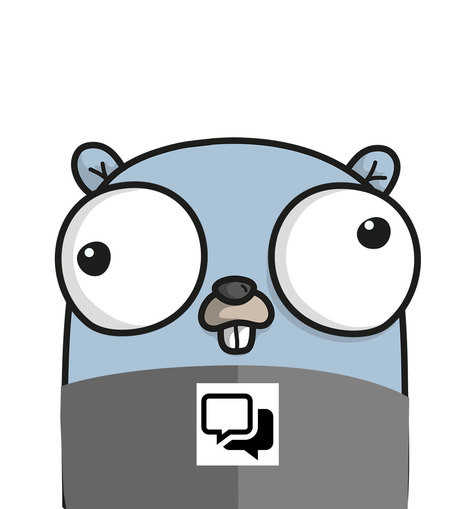

<p align="center"> </p> 
<p align="center"> <a href="https://travis-ci.org/oleg-balunenko/simple-chat"> 
        </img>
    </a>
    <a href="https://goreportcard.com/report/github.com/oleg-balunenko/simple-chat">
        </img>
    </a>
    <a href='https://coveralls.io/github/oleg-balunenko/simple-chat?branch=master'>
        
     </a>
    <a href="https://codecov.io/gh/oleg-balunenko/simple-chat">
      
    </a>
    <a href="https://codebeat.co/projects/github-com-oleg-balunenko-simple-chat-master">
        
    </a>
    <a href="https://sonarcloud.io/dashboard?id=simple-chat">
        </img>
    </a>
    <a href="https://app.codacy.com/app/oleg.balunenko/simple-chat?utm_source=github.com&utm_medium=referral&utm_content=oleg-balunenko/simple-chat&utm_campaign=Badge_Grade_Dashboard">
        
    </a>
    <a href="https://github.com/oleg-balunenko/simple-chat/releases/latest">
        </img>
    </a>
</p>

# simple-chat


Chat application that allows to send messages between host and guest users

## Usage

### Flags

```text
 -ip string
    	server machine ip
 -listen
    	Listens on the specified ip address
 -port string
    	server port (default "8080")

```

#### Run host

Open console and run executable `simple-chat` file with flag `-listen` and pass the `ip` of your machine as argument

##### Example:

```bash
./simple-chat -listen -ip=192.168.02.11
```

#### Run guest

Open console and run executable `simple-chat` file and pass as the `ip` of `host` as argument

##### Example:

```bash
./simple-chat -ip=192.168.02.11

```

======================================

Now you can send messages via guest and host.
